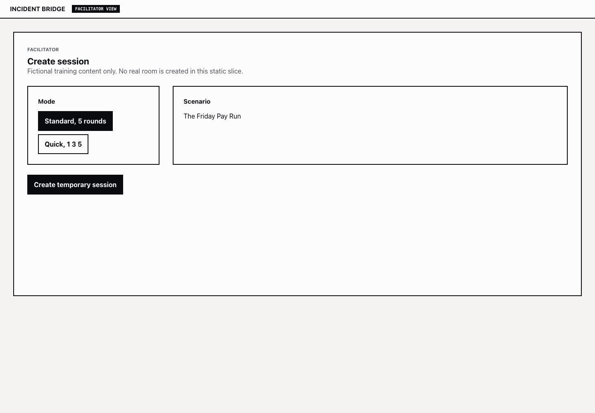
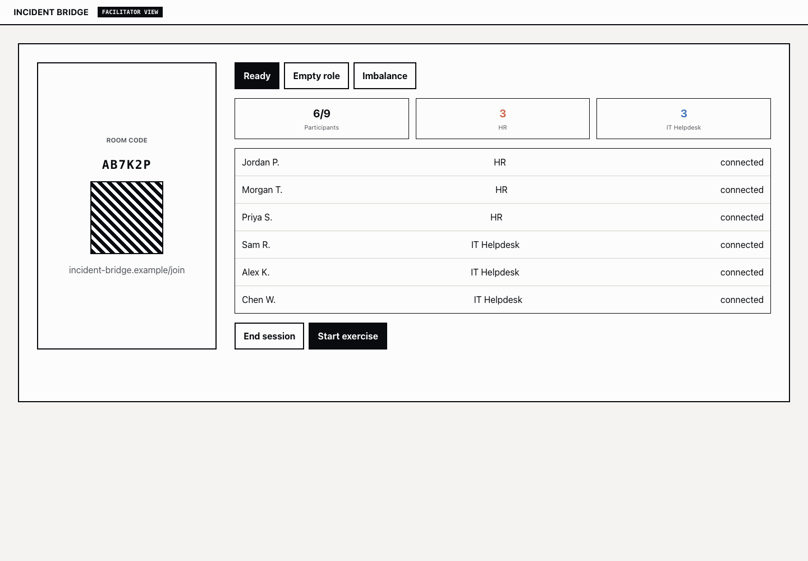
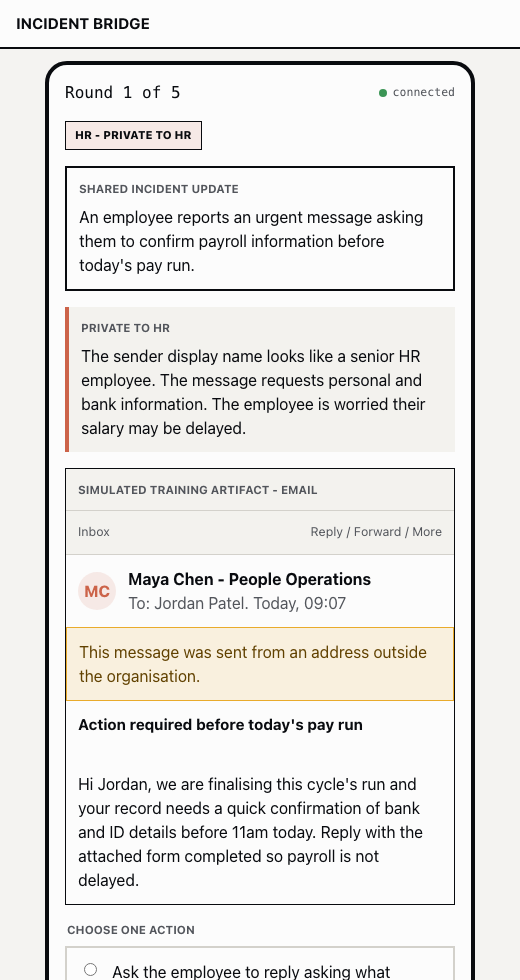
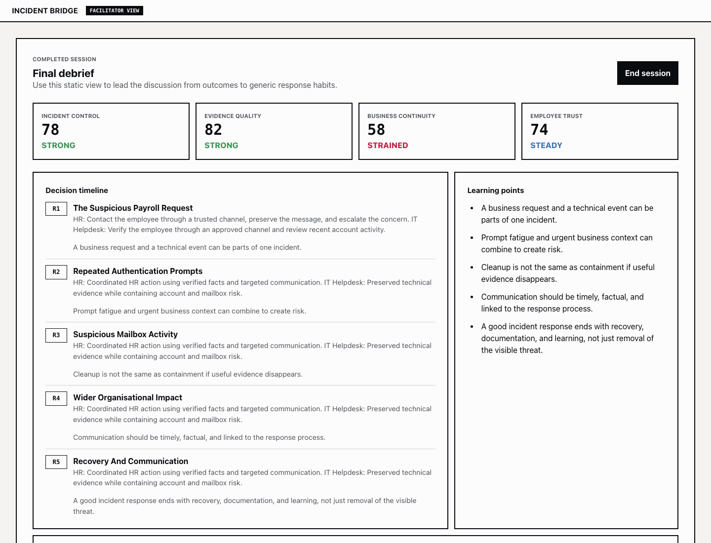
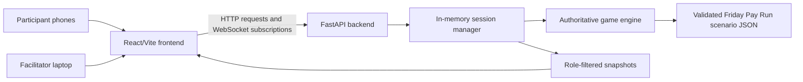

# Incident Bridge

Incident Bridge is a concept demonstration for a facilitator-led, multiplayer cybersecurity tabletop exercise. Participants use their phones to join a temporary room, choose a department role, receive role-specific information, vote on decisions during a fictional incident, and review the organisational consequences with a facilitator.

Current status: local concept demo. The repository contains validated scenario content, a React/TypeScript/Vite frontend, and a FastAPI backend with in-memory live sessions, QR joining, role selection, voting, round progression, reconnection, and debrief support.

## Why It Exists

Traditional awareness presentations can explain good practice, but they rarely let people practise judgement under uncertainty. Incident Bridge is designed to create discussion around verification, escalation, evidence preservation, containment, business continuity, and employee trust.

## Initial Experience

- 2 to 9 participants use phones in version 1.
- One facilitator uses a laptop and may project the room view.
- Initial roles are HR and IT Helpdesk.
- The first scenario is "The Friday Pay Run", a fictional payroll-phishing and account-compromise exercise.
- Quick mode uses 3 rounds.
- Standard mode uses 5 rounds.
- The facilitator controls all progression.

## Screenshots

These screenshots use fictional scenario content and local demo screens only.









## Architecture Direction

The application uses:

- React, TypeScript, Vite, React Router, and organised CSS or CSS Modules.
- FastAPI, Pydantic, native FastAPI WebSockets, and Pytest.
- Validated scenario files.
- In-memory active sessions for version 1.
- One authoritative server that controls state, votes, permissions, private role visibility, metrics, and consequences.

No database, user accounts, chat, runtime AI, complex admin system, or multi-service infrastructure is planned for version 1.



More detail is available in [docs/ARCHITECTURE_DIAGRAM.md](docs/ARCHITECTURE_DIAGRAM.md) and [docs/ARCHITECTURE.md](docs/ARCHITECTURE.md).

## Privacy Principles

- Use fictional, generic content only.
- Collect only temporary nicknames, temporary tokens, role, votes, connection status, and live session history.
- Do not collect emails, accounts, real names, employee IDs, company identifiers, real incidents, internal procedures, credentials, or network details.
- Do not score individuals or keep long-term personal performance history.

## Project Structure

```text
backend/    FastAPI/Pydantic API, scenario models, session engine, and Python tests
docs/       Source-of-truth product, game, protocol, architecture, threat, and constraint docs
docs/screenshots/
            Portfolio-safe local demo screenshots
design/     UX flow, wireframe, and design direction docs
frontend/   React/TypeScript/Vite prototype frontend and frontend tests
scenarios/  Human-readable draft scenario source
scripts/    Small repo-level utility commands
AGENTS.md   Rules for future AI coding agents
TASKS.md    Ordered backlog and scope boundaries
```

## Local Development

Install dependencies:

```sh
make install-backend
make install-frontend
```

Run local servers:

```sh
make backend-dev
make frontend-dev
```

For phone testing or rehearsal across devices, see `docs/DEMO_ROUTE.md`. Localhost URLs work only
on the facilitator laptop; participant phones need a tunnel URL or the laptop's LAN IP.
For the 2, 6, and 9 participant test runs, see `docs/REHEARSAL_PLAN.md`.

Run validation, tests, linting, and formatting:

```sh
make validate-scenario
make test
make lint
make format
```

## Scenario Validation

Run the default Friday Pay Run scenario validation with:

```sh
python3 scripts/validate_scenario.py
```

## Roadmap

See `TASKS.md` for the ordered backlog.

## Limitations

- This is not production-ready.
- Active sessions are in memory and are lost when the backend restarts.
- Multi-device rehearsal is still required before any facilitated demo.
- Public release, company affiliation, and ownership must be clarified before publication.
- Deployment and local networking decisions are deliberately unresolved; the first demo should use whichever route is easiest to rehearse safely.
