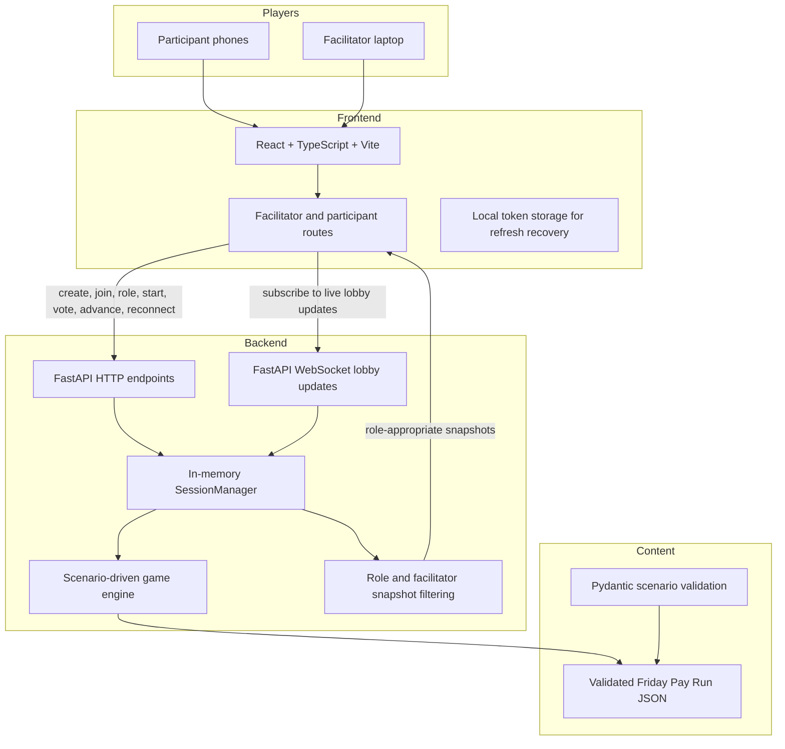

# Architecture Diagram

Incident Bridge version 1 is a single-instance local demo. The backend is authoritative for session
state, role visibility, votes, metrics, and progression. Clients send intentions and receive
filtered snapshots.

## Version 1 Boundaries

- Active sessions are in memory and are lost on backend restart.
- One backend instance owns all live state.
- Scenario content is data, not executable code.
- No database, account system, runtime AI, chat, leaderboard, or long-term analytics.
- Multi-device rehearsal should use a temporary tunnel or a trusted local network route.
